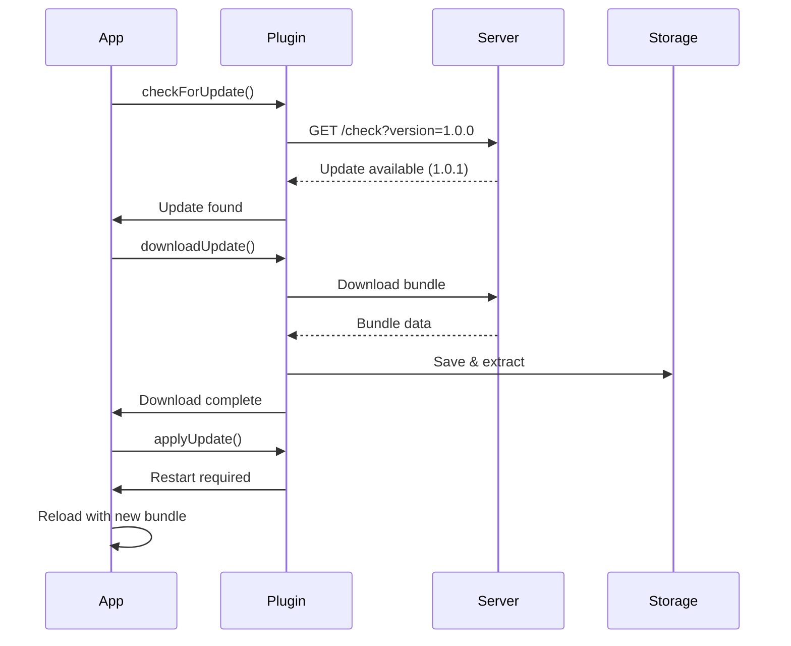

# Live Updates (OTA) Implementation Guide

This comprehensive guide explains how to implement Live Updates (Over-The-Air updates) in your Capacitor application using the NativeUpdate plugin.

## Table of Contents

- [Overview](#overview)
- [How Live Updates Work](#how-live-updates-work)
- [Setup Guide](#setup-guide)
- [Implementation Steps](#implementation-steps)
- [Update Server Setup](#update-server-setup)
- [Advanced Features](#advanced-features)
- [Best Practices](#best-practices)
- [Troubleshooting](#troubleshooting)

## Overview

Live Updates allow you to push JavaScript, HTML, CSS, and asset updates to your app without going through the app store review process. This enables:

- 🚀 Instant bug fixes
- ✨ Feature toggles
- 🎨 UI/UX improvements
- 📊 A/B testing
- 🔧 Quick configuration changes

### What Can Be Updated

✅ **Can Update:**

- JavaScript bundles
- HTML files
- CSS stylesheets
- Images and assets
- JSON configuration
- Web fonts

❌ **Cannot Update:**

- Native code (Java/Kotlin/Swift/Objective-C)
- Native plugins
- Platform-specific configurations
- App permissions

## How Live Updates Work



## Setup Guide

### 1. Install the Plugin

```bash
npm install native-update
npx cap sync
```

### 2. Configure the Plugin

#### capacitor.config.json

```json
{
  "appId": "com.example.app",
  "appName": "My App",
  "plugins": {
    "NativeUpdate": {
      "updateUrl": "https://updates.yourdomain.com/api/v1",
      "enabled": true,
      "autoCheck": true,
      "checkInterval": 3600,
      "channel": "production",
      "publicKey": "your-base64-public-key",
      "enforceSignature": true,
      "updateStrategy": "immediate",
      "maxVersions": 3
    }
  }
}
```

### 3. iOS Additional Setup

Add to `Info.plist`:

```xml
<key>NativeUpdateEnabled</key>
<true/>
<key>NativeUpdateURL</key>
<string>https://updates.yourdomain.com/api/v1</string>
```

### 4. Android Additional Setup

Add to `AndroidManifest.xml`:

```xml
<uses-permission android:name="android.permission.INTERNET" />
<uses-permission android:name="android.permission.ACCESS_NETWORK_STATE" />
```

## Implementation Steps

### Step 1: Basic Implementation

```typescript
import { NativeUpdate } from 'native-update';

export class UpdateManager {
  async checkAndUpdate() {
    try {
      // Sync with the update server
      const result = await NativeUpdate.sync();

      switch (result.status) {
        case 'UPDATE_AVAILABLE':
          console.log(`Update available: ${result.bundle?.version}`);
          // Update will be downloaded automatically by sync
          break;
        case 'UPDATE_INSTALLED':
          console.log(`Update installed: ${result.bundle?.version}`);
          // Reload the app to apply the update
          await NativeUpdate.reload();
          break;
        case 'UP_TO_DATE':
          console.log('App is up to date');
          break;
        case 'ERROR':
          console.error('Update error:', result.error);
          break;
      }
    } catch (error) {
      console.error('Update failed:', error);
    }
  }
}
```

### Step 2: Advanced Implementation with UI

```typescript
import { NativeUpdate } from 'native-update';
import { AlertController, LoadingController } from '@ionic/angular';

export class UpdateService {
  constructor(
    private alertCtrl: AlertController,
    private loadingCtrl: LoadingController
  ) {}

  async checkForUpdates(silent = false) {
    try {
      const result = await NativeUpdate.sync();

      if (result.status === 'UP_TO_DATE') {
        if (!silent) {
          await this.showAlert('No Updates', 'Your app is up to date!');
        }
        return;
      }

      if (result.status === 'UPDATE_AVAILABLE' || result.status === 'UPDATE_INSTALLED') {
        // Show update dialog
        const alert = await this.alertCtrl.create({
          header: 'Update Available',
          message: `Version ${result.version} is available.\n\n${result.description || 'Bug fixes and improvements'}`,
          buttons: [
            {
              text: result.mandatory ? 'Update Now' : 'Later',
              role: 'cancel',
              handler: () => {
                if (result.mandatory) {
                  // Force update for mandatory updates
                  this.downloadAndApplyUpdate();
                  return false;
                }
              },
            },
            {
              text: 'Update',
              handler: () => {
                this.downloadAndApplyUpdate();
              },
            },
          ],
          backdropDismiss: !result.mandatory,
        });

      await alert.present();
    } catch (error) {
      console.error('Update check failed:', error);
    }
  }

  private async downloadAndApplyUpdate() {
    const loading = await this.loadingCtrl.create({
      message: 'Downloading update...',
      backdropDismiss: false,
    });

    await loading.present();

    try {
      // Download with progress
      // The sync method already handles downloading
      // Progress tracking would be done via event listeners
      const downloadListener = NativeUpdate.addListener(
        'downloadProgress',
        (progress) => {
          loading.message = `Downloading... ${Math.round(progress.percent)}%`;
        }
      );

      loading.message = 'Applying update...';

      // Apply the update
      await NativeUpdate.reload();

      // The app will restart automatically
    } catch (error) {
      await loading.dismiss();
      await this.showAlert('Update Failed', error.message);
    }
  }

  private async showAlert(header: string, message: string) {
    const alert = await this.alertCtrl.create({
      header,
      message,
      buttons: ['OK'],
    });
    await alert.present();
  }
}
```

### Step 3: Auto-Update on App Start

```typescript
// app.component.ts
import { Component, OnInit } from '@angular/core';
import { Platform } from '@ionic/angular';
import { UpdateService } from './services/update.service';

@Component({
  selector: 'app-root',
  templateUrl: 'app.component.html',
})
export class AppComponent implements OnInit {
  constructor(
    private platform: Platform,
    private updateService: UpdateService
  ) {}

  async ngOnInit() {
    await this.platform.ready();

    // Check for updates on app start
    await this.updateService.checkForUpdates(true);

    // Set up periodic checks
    setInterval(
      () => {
        this.updateService.checkForUpdates(true);
      },
      60 * 60 * 1000
    ); // Every hour
  }
}
```

### Step 4: Update Strategies

```typescript
// Different update strategies
export class UpdateStrategies {
  // Immediate update (default)
  async immediateUpdate() {
    const result = await NativeUpdate.sync();
    if (result.status === 'UPDATE_INSTALLED') {
      await NativeUpdate.reload(); // Restarts immediately
    }
  }

  // Update on next restart
  async updateOnRestart() {
    const result = await NativeUpdate.sync();
    if (result.status === 'UPDATE_INSTALLED') {
      // Update is already installed, just don't reload immediately
      // Update will be applied on next app restart
    }
  }

  // Update with confirmation
  async updateWithConfirmation() {
    const result = await NativeUpdate.sync();
    if (result.status === 'UPDATE_INSTALLED') {
      // Show confirmation dialog
      const confirmed = await this.showUpdateReadyDialog();
      if (confirmed) {
        await NativeUpdate.reload();
      }
    }
  }
}
```

## Update Server Setup

### Option 1: Use Our Example Server

```bash
cd server-example
npm install
npm start
```

### Option 2: Implement Your Own

#### Bundle Structure

```
bundle-1.0.1.zip
├── www/
│   ├── index.html
│   ├── js/
│   │   └── app.bundle.js
│   ├── css/
│   │   └── styles.css
│   └── assets/
│       └── images/
└── manifest.json
```

#### manifest.json

```json
{
  "version": "1.0.1",
  "minNativeVersion": "1.0.0",
  "timestamp": "2023-12-01T00:00:00Z",
  "files": ["www/index.html", "www/js/app.bundle.js", "www/css/styles.css"]
}
```

#### Server API Requirements

**Check Endpoint:**

```http
GET /api/v1/check?version=1.0.0&channel=production&appId=com.example.app
```

Response:

```json
{
  "available": true,
  "version": "1.0.1",
  "url": "https://updates.example.com/bundles/1.0.1.zip",
  "mandatory": false,
  "notes": "Bug fixes and performance improvements",
  "size": 2048576,
  "checksum": "sha256:abc123...",
  "signature": "base64signature...",
  "minNativeVersion": "1.0.0"
}
```

### Creating Update Bundles

```bash
# 1. Build your web app
npm run build

# 2. Create bundle
cd dist
zip -r ../bundle-1.0.1.zip www/

# 3. Sign the bundle (optional but recommended)
cd ..
npx native-update bundle sign bundle-1.0.1.zip --key private.key

# 4. Upload to server
curl -X POST https://updates.example.com/api/v1/bundles \
  -H "Authorization: Bearer $ADMIN_TOKEN" \
  -F "file=@bundle-1.0.1.zip" \
  -F "version=1.0.1" \
  -F "channel=production" \
  -F "notes=Bug fixes"
```

## Advanced Features

### 1. Update Channels

```typescript
// Development channel for testing
await NativeUpdate.setChannel({ channel: 'development' });

// Production channel for users
await NativeUpdate.setChannel({ channel: 'production' });

// Beta channel for early adopters
await NativeUpdate.setChannel({ channel: 'beta' });
```

### 2. Delta Updates

```typescript
// Delta updates would be handled server-side
// The sync() method will automatically use delta updates if available
// Configure your server to provide delta updates when appropriate
```

### 3. Rollback Support

```typescript
// List all downloaded bundles
const bundles = await NativeUpdate.list();

// Rollback to original app bundle
await NativeUpdate.reset();

// Rollback to a specific bundle
if (bundles.length > 1) {
  const previousBundle = bundles[bundles.length - 2];
  await NativeUpdate.set(previousBundle);
  await NativeUpdate.reload();
}
```

### 4. Update Metrics

```typescript
// Implement your own metrics tracking
class UpdateMetrics {
  async trackSuccess(version: string, duration: number) {
    // Send to your analytics service
    await analytics.track('update_success', {
      version,
      duration,
      timestamp: Date.now()
    });
  }

  async trackFailure(version: string, error: string) {
    // Send to your analytics service
    await analytics.track('update_failure', {
      version,
      error,
      timestamp: Date.now()
    });
  }
}
```

### 5. Custom Update UI

```typescript
// Disable auto-check
await NativeUpdate.configure({
  autoCheck: false,
});

// Implement custom UI
class CustomUpdateUI {
  async showUpdateFlow() {
    // Custom check
    const update = await NativeUpdate.sync();

    if (update.status === 'UPDATE_AVAILABLE' || update.status === 'UPDATE_INSTALLED') {
      // Show custom UI
      const modal = await this.modalCtrl.create({
        component: UpdateModalComponent,
        componentProps: { update },
      });

      await modal.present();
    }
  }
}
```

## Best Practices

### 1. Version Management

```typescript
// Semantic versioning
const versions = {
  major: '2.0.0', // Breaking changes
  minor: '1.1.0', // New features
  patch: '1.0.1', // Bug fixes
};

// Skip versions if needed
const skipVersions = ['1.0.2', '1.0.3']; // Known bad versions
```

### 2. Error Handling

```typescript
class RobustUpdateManager {
  async safeUpdate() {
    try {
      await NativeUpdate.sync();
    } catch (error) {
      if (error.code === 'NETWORK_ERROR') {
        // Retry with exponential backoff
        await this.retryWithBackoff();
      } else if (error.code === 'INVALID_SIGNATURE') {
        // Security issue - don't apply
        await this.reportSecurityIssue(error);
      } else {
        // Generic error handling
        console.error('Update failed:', error);
      }
    }
  }
}
```

### 3. Testing Updates

```typescript
// Test in development
if (environment.development) {
  // Force check against staging server
  await NativeUpdate.configure({
    updateUrl: 'https://staging-updates.yourdomain.com',
    channel: 'development',
  });
}

// A/B testing
const testGroup = user.id % 2 === 0 ? 'A' : 'B';
await NativeUpdate.setChannel({
  channel: `production-${testGroup}`,
});
```

### 4. Performance Optimization

```typescript
// Download during off-peak hours
const now = new Date().getHours();
if (now >= 2 && now <= 6) {
  // Download priority would be configured during sync
  await NativeUpdate.sync();
}

// Download management would be handled by the sync() method
// For custom download control, implement your own download manager
// that uses the download() method with proper retry logic
```

## Troubleshooting

### Common Issues

1. **Update not applying**

   ```typescript
   // Check current bundle status
   const current = await NativeUpdate.current();
   console.log('Current bundle:', current);
   
   // List all bundles to see if update was downloaded
   const bundles = await NativeUpdate.list();
   console.log('Available bundles:', bundles);
   
   // If update bundle exists but not active, set it
   const updateBundle = bundles.find(b => b.version === 'new-version');
   if (updateBundle && updateBundle.bundleId !== current.bundleId) {
     await NativeUpdate.set(updateBundle);
     await NativeUpdate.reload();
   }
   ```

2. **Signature verification fails**

   ```typescript
   // Check current configuration by examining the plugin setup
   // Configuration is set during plugin initialization
   console.log('Verify your capacitor.config.json for publicKey setting');
   ```

3. **Storage issues**
   ```typescript
   // Delete old bundles, keeping only the latest N versions
   await NativeUpdate.delete({
     keepVersions: 2  // Keep only 2 most recent versions
   });
   
   // Or delete bundles older than a certain date
   const thirtyDaysAgo = Date.now() - (30 * 24 * 60 * 60 * 1000);
   await NativeUpdate.delete({
     olderThan: thirtyDaysAgo
   });
   ```

### Debug Mode

```typescript
// Enable debug logging through your app's logging system
// The plugin will log errors and important events automatically

// Monitor update events
NativeUpdate.addListener('downloadProgress', (progress) => {
  console.log('Download progress:', progress);
});

NativeUpdate.addListener('updateStateChanged', (state) => {
  console.log('Update state:', state);
});
```

### Health Checks

```typescript
// Implement your own health check system
class UpdateHealthCheck {
  async checkHealth() {
    const current = await NativeUpdate.current();
    const bundles = await NativeUpdate.list();
    
    const health = {
      currentVersion: current.version,
      currentBundleId: current.bundleId,
      bundleStatus: current.status,
      totalBundles: bundles.length,
      lastUpdateTime: current.downloadTime,
      isVerified: current.verified
    };
    
    console.log('Update system health:', health);
    return health;
  }
}
```

## Security Considerations

1. **Always use HTTPS** for update servers
2. **Implement bundle signing** to prevent tampering
3. **Validate checksums** before applying updates
4. **Use certificate pinning** for extra security
5. **Implement rollback** mechanisms for safety
6. **Monitor update metrics** to detect issues

## Next Steps

- Read the [Native App Updates Guide](./NATIVE_UPDATES_GUIDE.md)
- Learn about [App Review Integration](./APP_REVIEW_GUIDE.md)
- Check out [Security Best Practices](./guides/security-best-practices.md)
- See [Bundle Signing Documentation](./BUNDLE_SIGNING.md)
